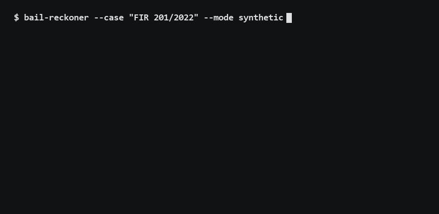

# Bail Reckoner



India's law entitles an undertrial prisoner to release once they have spent half the
maximum possible sentence in jail awaiting trial, or a third of it for a first offence.
That is Section 479 of the Bharatiya Nagarik Suraksha Sanhita, 2023, and it is
arithmetic. The arithmetic mostly goes undone, which is why the Ministry of Law and
Justice posed problem statement SIH1702.

This system does the arithmetic. It walks six statutory gates in a fixed order, shows
every step, and cites the exact provision behind each one. It does not predict what a
court will do, it scores no one, and it decides nothing. The output is a working a
legal-aid worker or jail officer can check line by line, plus a draft of the
application the jail Superintendent is legally required to make.

## The honest status, first

The engine is proved correct by 442 passing tests against synthetic fixtures. The
database of real offence punishments contains zero verified rows, because a verified
row requires a human to read the actual page of the actual statute and sign their
name. A machine drafted the 86 rows in the review queue; the same machine signing them
would be the machine agreeing with itself. Until those rows are signed, every
demonstration you can run here is synthetic and labelled as such.

This is the project's central design position. Where the law is unsettled, the system
flags and routes to a human. Where a value could not be detected, it says so instead
of substituting something plausible. The same defect (a plausible answer where a
refusal belongs) was found and eliminated six separate times during construction, each
time converted into a rule with a test.

## What is inside

A pure decision engine with no model, no network and no file access in the decision
path, so its correctness is provable rather than measured. Around it: search over
2,245 sections of 8 acts, verbatim extracts from Supreme Court judgments (never
summaries, because a summary could hallucinate a citation), a text-extraction seam
with a mandatory human confirmation step, a REST API whose every response states how
many verified rows exist, a server-rendered interface under hard design rules (no
colour ever encodes an outcome), a deterministic PDF generator for the court filing,
and an append-only audit log with a hash chain.

Every source document carries a SHA-256 hash re-verified by the test suite. Every
measured number states its claim class, and classes are never blended: the only
claimable accuracy is the independently recomputed arithmetic. Two of the retrieval
findings are original results: a cross-encoder reranker destroyed a quarter of correct
results, and dense embeddings scored 0.000 on citation-style queries.

## Running it

```
cd 06_src
python -m venv .venv && .venv\Scripts\pip install -r requirements.lock
.venv\Scripts\python -m pytest -q          # full suite, ~10 minutes
.venv\Scripts\uvicorn --factory bail_reckoner.api.app:create_app
```

A fresh clone needs the retrieval corpus rebuilt once (call `build_corpus()` from
`bail_reckoner.retrieval.corpus`). Start with [DEVELOPER_GUIDE.md](DEVELOPER_GUIDE.md).

## How AI was used

I built this with an AI coding agent (Anthropic's Claude) working under my direction.
It wrote code, drafted documents, and ran verification. Every consequential decision
came to me for approval, every statutory text was checked against the official gazette
or India Code, and the review of actual law pages is human work that no machine output
replaces: the database ships with zero verified rows until a person reads the page and
signs. The AI is not an author here. The work is the team's, and a complete engineering
log of the AI-assisted sessions, including every decision and the reasoning behind it,
is kept outside this repository and is available on request. Documents here
sometimes cite that log's entry numbers (D-numbers) or its files by name
(DECISIONS.md, CLAUDE.md, PROGRESS.md, OPEN_ITEMS.yaml); those live with the
private record, not in this repository.

## Team

Final-year B.Tech major project, CSE (AI and ML), Marri Laxman Reddy Institute of
Technology and Management, Hyderabad, 2026-27. Vallamalla Abhishek Prakash (lead),
Revuru Arya, Modhumpally Arvind, Boru Vimala. Problem statement SIH1702, Ministry of
Law and Justice, Government of India.

No advocate reviewed this project, and the record says so wherever it matters. It is a
decision-support aid. It is never a decision-maker.
